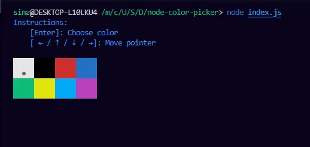

# node-color-picker [](https://www.npmjs.com/package/node-color-picker) [](https://npmjs.org/package/node-color-picker) [](https://npmjs.org/package/node-color-picker)

A simple terminal color picker for Node.js.



## Installation

```shell
npm i node-color-picker
```

## Usage

```js
// * index.js

import { colorPicker } from 'node-color-picker';

const app = async () => {
  const color = await colorPicker();
  console.log(color);
};
```

Then run :

```shell
node index.js
```

## Options

|      |  Type   | Default |           Description           |
|------|---------|---------|---------------------------------|
| hint | boolean | `True`  | Whether to show the hint or not |

```
colorPicker(options);
```